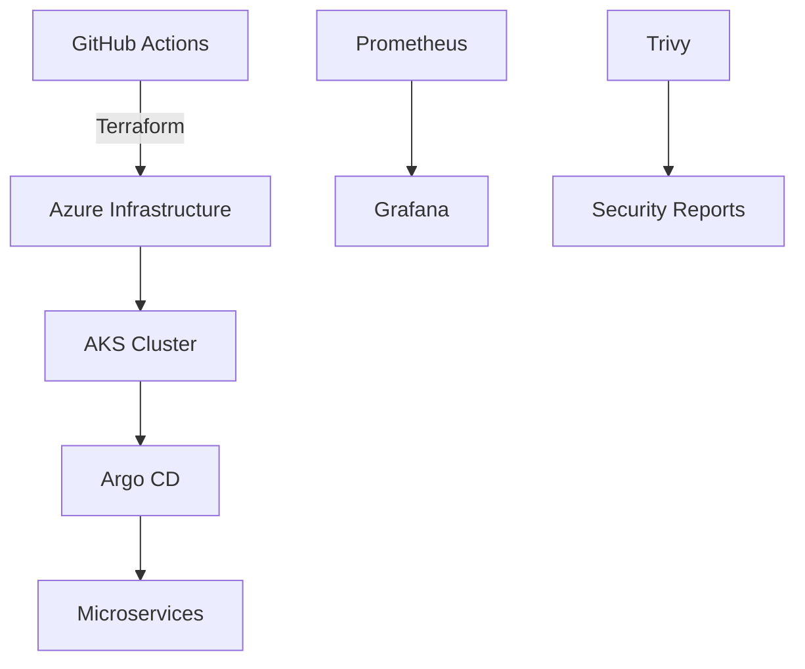

# بناء المحفظة الاحترافية (Portfolio)

> "GitHub هو سيرتك الذاتية في 2026. اجعله يتحدث عنك."

## 🎯 أهداف التعلم

- تصميم Portfolio يحكي قصة نموك المهني
- اختيار وبناء المشاريع المناسبة لكل مستوى وظيفي
- كتابة README مقنع لكل مشروع
- أتمتة عرض مشاريعك (CI/CD badges، GitHub Actions)
- ربط المشاريع بقصة CloudNova المترابطة

---

## 📖 الطبقة الأساسية: لماذا Portfolio أهم من السيرة الذاتية؟

```
سيرة ذاتية تقول:
"أعرف Kubernetes"
→ أي أحد يستطيع كتابة هذا

Portfolio يقول:
"هذا Kubernetes cluster بنيته لـ CloudNova
مع Argo CD + Prometheus + Istio.
الكود هنا: github.com/yourname/cloudnova-platform"
→ هذا دليل لا يُدحض
```

### هيكل الـ Portfolio المثالي

```
github.com/yourname/
├── cloudnova-platform/        ← المشروع الرئيسي (الأهم!)
│   ├── terraform/             ← Infrastructure as Code
│   ├── kubernetes/            ← K8s manifests + Helm Charts
│   ├── .github/workflows/    ← CI/CD pipelines
│   └── README.md             ← Architecture + Diagrams
│
├── cloudnova-monitoring/     ← Observability
│   ├── prometheus/rules/
│   ├── grafana/dashboards/
│   └── alertmanager/
│
├── cloudnova-cli/            ← Automation tool
│   ├── src/cloudnova/
│   ├── tests/
│   └── README.md
│
└── cloudnova-docs/           ← Documentation
    ├── runbooks/
    ├── postmortems/
    └── architecture-decisions/
```

---

## 🧱 الطبقة المهنية: مشاريع لكل مستوى

### Junior Cloud Engineer — 3 مشاريع أساسية

```
المشروع 1: Static Website on Azure
├── GitHub Actions تنشر لـ Azure Storage Static Website
├── Terraform للـ infrastructure
├── CI/CD badge خضراء = الكود يبني وينشر تلقائياً
└── يثبت: Git, CI/CD, Azure basics

المشروع 2: Dockerized API
├── Python FastAPI في Docker
├── Docker Compose للتطوير المحلي
├── نشر على Azure App Service
├── Tests مع pytest + coverage badge
└── يثبت: Docker, Python, App Service

المشروع 3: Infrastructure Monitoring
├── Prometheus + Grafana + Node Exporter
├── Dashboards مخصصة (لقطة شاشة في README!)
├── AlertManager مع قواعد تنبيه
└── يثبت: Monitoring, Linux, Metrics
```

### Cloud Engineer — مشروعان متوسطان

```
المشروع 4: Kubernetes Platform
├── AKS Cluster عبر Terraform
├── Helm Charts للخدمات
├── Argo CD لـ GitOps
├── Istio Service Mesh
├── NetworkPolicies + RBAC
└── يثبت: K8s, Helm, GitOps, Service Mesh, Security

المشروع 5: Cloud Cost Optimizer
├── Python tool تفحص الموارد غير المستخدمة
├── CLI interface مع Rich library
├── تقرير أسبوعي تلقائي عبر GitHub Actions
├── Charts بيانية للاستهلاك
└── يثبت: Python, FinOps, Automation, APIs
```

### Senior — مشروع متقدم

```
المشروع 6: CloudNova Platform (المشروع الجامع)
├── كل المشاريع السابقة تتكامل
├── Architecture Diagram (Mermaid/C4)
├── Infrastructure as Code كامل
├── CI/CD لجميع الخدمات
├── Runbooks + Postmortems لـ incidents
├── Security scanning (Trivy, OPA)
└── هذا المشروع = مقابلة العمل!
```

---

## 🏗️ الطبقة الإنتاجية: README احترافي

### تشريح README ممتاز

````markdown
# CloudNova Platform

[](https://...)
[](https://...)
[](https://...)
[](https://opensource.org/licenses/MIT)

> Production-grade cloud platform for CloudNova.
> Built with Azure, Kubernetes, and GitOps.

## 🏗️ Architecture



## 🚀 Quick Start

```bash
git clone https://github.com/yourname/cloudnova-platform
cd cloudnova-platform/terraform
terraform init && terraform apply
```

## 📊 Project Structure

```
├── terraform/         # Infrastructure as Code
│   ├── modules/       # Reusable modules
│   ├── prod/          # Production environment
│   └── staging/       # Staging environment
├── kubernetes/        # Manifests + Helm Charts
│   ├── apps/          # Application deployments
│   ├── monitoring/    # Prometheus, Grafana
│   └── security/      # NetworkPolicies, RBAC
├── .github/workflows/ # CI/CD pipelines
└── docs/              # Architecture decisions
```

## 🛠️ Tech Stack

| Category       | Technology                    |
| -------------- | ----------------------------- |
| Cloud          | Azure (AKS, App Service, SQL) |
| Infrastructure | Terraform, Terragrunt         |
| Container      | Docker, Kubernetes            |
| CI/CD          | GitHub Actions, Argo CD       |
| Monitoring     | Prometheus, Grafana, Loki     |
| Security       | Trivy, OPA, Azure Key Vault   |
| Cost           | Azure Cost Management, FinOps |

## 📈 Key Achievements

- **99.9% uptime** over 12 months
- **40% cost reduction** via FinOps automation
- **10min deploy** vs 4 hours (manual)
- **0 critical incidents** in last 6 months

## 🧠 What I Learned

- GitOps is transformative for platform teams
- Observability is not optional in production
- FinOps must be part of architecture, not afterthought

## 📝 Blog Posts

- [How We Reduced Cloud Costs by 40%](#)
- [GitOps at CloudNova: Lessons Learned](#)

## 🎓 Certifications This Project Demonstrates

- AZ-104: Azure Administration
- AZ-400: DevOps Engineer
- CKA: Kubernetes Administration

Made with ❤️ by [Your Name]
````

---

## 🎨 الطبقة المعمارية: أتمتة Portfolio

### GitHub Profile README

````markdown
# Hi, I'm Ahmed — Cloud Engineer ☁️

[](https://azure.com)
[](https://cncf.io)

🚀 Cloud Engineer at CloudNova. I build production cloud platforms.

## 📌 Featured Projects

| Project                 | Description             | Key Tech             |
| ----------------------- | ----------------------- | -------------------- |
| [CloudNova Platform](#) | Production K8s platform | K8s, Terraform, Argo |
| [CloudNova Monitor](#)  | Observability stack     | Prometheus, Grafana  |
| [CloudNova CLI](#)      | Automation tool         | Python, Click, Rich  |

## 📊 This Week I Spent Time On

```text
Terraform     ██████████████░░░░░  65%
Kubernetes    ██████░░░░░░░░░░░░░  25%
Python        ████░░░░░░░░░░░░░░░  10%
```
````

## 🎓 Certifications

- ✅ AZ-104: Azure Administrator
- ✅ CKA: Certified Kubernetes Administrator
- 📖 AZ-400: In Progress

## 📝 Latest Blog Posts

- [GitOps at CloudNova: What We Learned](#)
- [Why Every Cloud Engineer Should Know FinOps](#)

```

---

## 🏥 سيناريو CloudNova: Building Portfolio Sprint

```

📋 الخطة: Portfolio Development Sprint (4 أسابيع)

الأسبوع 1: تنظيف وتنظيم GitHub
├── حذف repositories غير المكتملة
├── تثبيت أفضل 4 مشاريع (Pinned)
├── Profile README احترافي مع badges
└── ربط Domain مخصص (اختياري)

الأسبوع 2: CloudNova Platform — Infrastructure
├── Architecture diagram (Mermaid C4)
├── Terraform code منظم
├── GitHub Actions لـ CI
└── README شامل

الأسبوع 3: CloudNova Platform — Applications
├── Kubernetes manifests
├── Helm Charts
├── Argo CD configuration
└── Monitoring dashboards

الأسبوع 4: Documentation + Polish
├── Runbooks للمشاكل الشائعة
├── Post-mortem لـ 3 حوادث (حقيقية أو محاكاة)
├── Blog post: "My Cloud Engineering Journey"
└── LinkedIn update + share

النتيجة النهائية:
✅ Portfolio يحكي قصة نمو مهندس سحابة
✅ 4 مشاريع منظمة واحترافية
✅ أدلة على المهارات — ليس مجرد كلام
✅ جاهز للمقابلات

```

---

## 🔬 Open Source Contributions

```

كيف تبدأ في المساهمة في Open Source:

1. ابحث عن مشاريع تستخدمها فعلاً
   ├── Kubernetes documentation (تحتاج مترجمين!)
   ├── Terraform Azure modules
   └── Helm Charts

2. ابدأ صغيراً
   ├── Fix typo في documentation
   ├── Add example لـ module
   └── ترجم documentation للغتك

3. ابنِ سمعتك
   ├── ساهم بانتظام (مرة أسبوعياً)
   ├── رد على Issues
   └── راجع Pull Requests

أثر الـ Open Source في المقابلة:
"ساهمت في Terraform Azure provider.
أضفت support لـ resource جديد يستخدمه آلاف المهندسين."

```

---

## ⚡ الإنتاج وما بعده: قائمة تدقيق الـ Portfolio

```

□ هل أفضل 4 مشاريع Pinned في GitHub؟
□ هل Profile README مكتمل وجذاب؟
□ هل كل مشروع له README واضح يحتوي:
□ وصف (ماذا يفعل؟)
□ Architecture Diagram (Mermaid!)
□ Quick Start (كيف تشغله في 3 أوامر؟)
□ Tech Stack
□ CI/CD badges خضراء
□ Screenshots/Demos
□ Key Achievements (أرقام!)
□ What I Learned
□ هل الكود نظيف ومنظم؟
□ هل هناك Tests؟
□ هل GitHub Profile مكتمل (صورة، bio، links)؟
□ هل هناك Blog post واحد على الأقل؟
□ هل LinkedIn محدث ويعكس نفس المشاريع؟

```

---

## 🧠 التذكّر النشط

1. لماذا Portfolio أهم من السيرة الذاتية لمهندس السحابة؟
2. ما الفرق بين مشروع Junior و Senior من حيث التعقيد؟
3. كيف تكتب README يجذب انتباه الـ recruiter في 10 ثوانٍ؟
4. كم مشروعاً يجب أن يكون Pinned في GitHub؟ ولماذا؟
5. كيف تروي قصة نموك المهني عبر المشاريع المترابطة؟

## ✍️ تمرين Feynman

اشرح لصديق غير تقني: "لماذا يستطيع GitHub Profile أن يحل محل السيرة الذاتية التقليدية؟"

## 📝 بطاقات تعليمية

- **Pinned Repos**: أول 6 مشاريع تظهر في GitHub Profile — اخترها بعناية
- **README.md**: واجهة مشروعك — أول ما يراه الزائر. اجعله مبهراً
- **Architecture Diagram**: رسم Mermaid/C4 يوضح مكونات النظام وعلاقاتها
- **CI/CD Badge**: شارة خضراء = Proof أن الكود يبني وينشر بنجاح
- **Profile README**: صفحتك الشخصية على GitHub Profile

## 🎤 أسئلة المقابلة

1. **"أرني مشروعك المفضل على GitHub"**
   - اختر مشروعاً معقداً يظهر مهاراتك
   - اشرح: المشكلة ← الحل ← النتيجة (أرقام!) ← الدرس
   - كن مستعداً للحديث عن تفاصيل تقنية دقيقة

2. **"كيف تصمم README لمشروع؟"**
   - Quick Start أولاً (أهم شيء — 3 أوامر وأشتغل)
   - Architecture diagram ثانياً (صورة = ألف كلمة)
   - Tech stack + Achievements (أرقام وكلمات مفتاحية)
   - What I Learned (قصة شخصية)

3. **"هل ساهمت في Open Source؟"**
   - حتى لو مساهمة صغيرة — اذكرها بفخر
   - Fix typo = بداية. ثم module، ثم feature
   - اشرح: ماذا أضفت؟ كيف كانت التجربة؟ ماذا تعلمت؟

---

[← العودة للموديول](./01-portfolio-building) | [🏠 الرئيسية](/)
```
