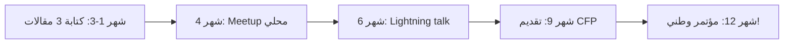

# التدوين التقني والمحادثات

> "المقال التقني الجيد يصل إلى آلاف المهندسين. المحادثة الجيدة تلهمهم."

## 🎯 أهداف التعلم

- كتابة مقال تقني مؤثر
- التحدث في المؤتمرات
- بناء سمعة تقنية

## ⏱️ الوقت المقدر: 25 دقيقة | المستوى: Junior

---

## 🏗️ هيكل المقال التقني

1. **عنوان جذاب**: "كيف خفضنا فاتورة Azure بنسبة 60% في أسبوعين"
2. **مقدمة**: المشكلة + لماذا هذا مهم
3. **الرحلة**: ماذا جربت + لماذا فشلت + ماذا نجح
4. **الحل**: كود + نتائج
5. **الخلاصة**: ماذا تعلمت + ما التالي

### أين تنشر؟

- **Dev.to**: مجتمع ضخم، visibility عالي
- **Medium**: احترافي، SEO قوي
- **LinkedIn Articles**: شبكتك المهنية
- **مدونتك الشخصية**: تحكم كامل (GitHub Pages!)

### التحدث في المؤتمرات

ابدأ صغيراً:

1. Meetup محلي (20 شخصاً)
2. مؤتمر صغير (100 شخص)
3. مؤتمر وطني (500+ شخص)

---

## 🏛️ CloudNova: من مقال إلى وظيفة أحلام

**سارة** مهندسة Azure. كتبت مقالاً واحداً عن "ترحيل 50 تطبيقاً إلى AKS دون downtime".

الأثر:

1. نشرته على **dev.to** و **LinkedIn**
2. 15,000 قراءة + 200 تفاعل في أسبوع
3. مدير Platform Engineering في شركة كبرى قرأه وتواصل معها
4. بعد 3 مقابلات: عرض عمل بـ 40% زيادة!

**لماذا نجح المقال؟**

- مشكلة حقيقية عانى منها مهندسون كثر
- حل عملي مع كود وأرقام
- قصة واقعية: "بدأنا بـ 3 أيام downtime، وصلنا إلى 4 دقائق"
- Mermaid diagrams للهندسة
- خلاصة واضحة في النهاية

### هيكل المقال المؤثر

```markdown
# العنوان: رقم + فعل + نتيجة

مثال: "كيف خفضنا فاتورة Azure 60% في أسبوعين"

## 1. المشكلة (Hook)

> "بعد 6 أشهر من الترحيل إلى Azure، فاتورتنا وصلت $45,000/شهر..."

## 2. السياق

- حجم الفريق: 8 مهندسين
- البنية: 200+ VM, 30 AKS clusters
- التحدي: هندسة معقدة + تكاليف غير متوقعة

## 3. الرحلة (القصة)

### المحاولة الأولى: Right-sizing — توفير 20%

### المحاولة الثانية: Reserved Instances — توفير 30%

### المحاولة الثالثة: Spot VMs + Auto-scaling — توفير 10%

## 4. الحل النهائي

\`\`\`hcl

# Terraform code للحل

\`\`\`

## 5. النتائج (أرقام!)

| المقياس          | قبل      | بعد     |
| ---------------- | -------- | ------- |
| الفاتورة الشهرية | $45,000  | $18,000 |
| utilization      | 35%      | 78%     |
| deployment time  | 45 دقيقة | 8 دقائق |

## 6. الدروس المستفادة

- لا تبدأ بـ Reserved Instances (مرونة منخفضة)
- Right-sizing أولاً، ثم auto-scaling، ثم reservations
- Monitoring أساسي: لا تحسّن ما لا تقيس
```

---

## 🎨 استراتيجية المحتوى لـ 6 أشهر

| الشهر | الموضوع                                  | المنصة      | الهدف     |
| ----- | ---------------------------------------- | ----------- | --------- |
| 1     | "كيف بدأت في Cloud Engineering"          | LinkedIn    | 5K views  |
| 2     | "Terraform vs Bicep: مقارنة عملية"       | dev.to      | 10K views |
| 3     | "أخطاء Kubernetes الشائعة في production" | Medium      | 15K views |
| 4     | حديث في meetup محلي                      | Offline     | 50 حضور   |
| 5     | "Azure Cost Optimization: الدليل الكامل" | مدونة شخصية | 20K views |
| 6     | مؤتمر محلي (CFP accepted!)               | Offline     | 200+ حضور |

### منصات النشر المقارنة

| المنصة          | الميزة              | العيب             | أفضل لـ        |
| --------------- | ------------------- | ----------------- | -------------- |
| **dev.to**      | مجتمع ضخم، SEO قوي  | منافسة عالية      | مقالات تقنية   |
| **Medium**      | جمهور احترافي       | paywall أحياناً   | تحليلات معمقة  |
| **LinkedIn**    | شبكتك المهنية       | visibility محدود  | Career stories |
| **مدونة شخصية** | تحكم كامل، branding | تحتاج جلب readers | محتوى متخصص    |
| **YouTube**     | وصول هائل           | إنتاج معقد        | شروحات عملية   |

### التحدث في المؤتمرات — خطة 12 شهراً



---

## 🛠️ تدريبات عملية

### تمرين 1: كتابة مقال كامل

اكتب مقالاً تقنياً عن أي موضوع درسته:

- اختر موضوعاً واحداً محدداً (ليس "كل شيء عن Azure"!)
- أضف كود حقيقي ونتائج حقيقية
- استخدم Mermaid diagram واحد على الأقل
- انشر على dev.to

### تمرين 2: تحضير Lightning Talk

```markdown
# Lightning Talk (5 دقائق)

العنوان: "كيف وفرت 60% من فاتورة Azure في أسبوعين"

Slide 1 (30s): المشكلة — "فاتورة Azure وصلت $45K"
Slide 2 (1min): السياق — "200 VM, 30 AKS"
Slide 3 (2min): الحل — "3 خطوات: Right-size, Reserve, Auto-scale"
Slide 4 (1min): النتائج — "$45K → $18K"
Slide 5 (30s): الخلاصة — "ابدأ بـ monitoring"

مارس التقديم 10 مرات على الأقل
سجّل نفسك وراجع
```

### تحدي: بناء مدونة تقنية على GitHub Pages

```bash
# ابنِ مدونة بـ Jekyll أو Hugo على GitHub Pages
# 1. اختر قالباً احترافياً
# 2. اكتب 3 مقالات
# 3. أضف Google Analytics
# 4. حسّن SEO
# 5. انشر على LinkedIn مع كل مقال
```

---

## 📝 تقييم

### ✅ Knowledge Checks

1. ما هيكل المقال التقني المؤثر؟
2. أين تنشر أول مقال تقني؟
3. كيف تبدأ مسيرة التحدث في المؤتمرات؟
4. ما الفرق بين dev.to و Medium؟
5. كيف تختار موضوعاً لمقال تقني؟

### 🧠 Quiz

**س1:** أفضل عنوان لمقال تقني:

- أ) "Azure"
- ب) "كيف خفضنا فاتورة Azure 60% في أسبوعين" ✅
- ج) "مقال عن السحابة"
- د) "تقنيات"

**س2:** أول خطوة للتحدث في المؤتمرات:

- أ) مؤتمر دولي
- ب) Meetup محلي ✅
- ج) TED talk
- د) بودكاست

**س3:** أهم عنصر في المقال التقني:

- أ) الطول
- ب) الأرقام والنتائج الحقيقية ✅
- ج) الصور
- د) الإعلانات

### 🗣️ Active Recall

1. صف رحلة مهندس من أول مقال إلى مؤتمر دولي
2. ارسم خطة محتوى لـ 6 أشهر
3. كيف تكتب عنواناً يجذب القراء؟
4. ما الفرق بين Tutorial و Case Study؟

### 🎓 Feynman Exercise

> اشرح قيمة التدوين التقني لزميل: "كل مقال هو مقابلة عمل غير مباشرة. المدير يقرأ مقالك ويفكر: 'هذا الشخص يفهم ما يتحدث عنه. لن أحتاج لاختباره تقنياً.'"

### 🃏 بطاقات تعلم

| السؤال                | الإجابة                               |
| --------------------- | ------------------------------------- |
| أفضل منصة لمقال تقني؟ | dev.to (مجتمع ضخم + SEO)              |
| كم مرة أنشر؟          | مرة شهرياً minimum                    |
| كيف أبدأ التحدث؟      | Meetup محلي أولاً                     |
| ما CFP؟               | Call For Proposals — طلب تقديم لمؤتمر |
| أهم عنصر في المقال؟   | نتائج حقيقية بأرقام                   |

---

## 🎤 أسئلة المقابلة

**س1 (سلوكي):** "أرني مقالاً تقنياً كتبته."

> أناقش: لماذا اخترت هذا الموضوع، كيف بحثت، ما feedback تلقيته، كم views، ماذا تعلمت. ليس المهم عدد القراء، المهم quality التفكير.

**س2 (تقني):** "كيف تشرح مفهوم Kubernetes لغير تقني؟"

> استخدم analogies: "مثل مدير مبنى. كل شقة حاوية. المدير يقرر أي شقة يسكنها المستأجر، يصلح الأعطال، ويضيف شقق جديدة عند الحاجة."

**س3:** "لماذا يجب أن أوظفك؟"

> المهارات التقنية + القدرة على التواصل. "أستطيع بناء AKS cluster، وأستطيع شرح تصميمه للإدارة. مهارتان نادرتان."

---

## 📚 المراجع

| النوع          | الرابط                                                     |
| -------------- | ---------------------------------------------------------- |
| **درس ذو صلة** | [GitHub Profile](./02-github-profile-mastery)              |
| **منصة**       | [dev.to](https://dev.to/)                                  |
| **أداة**       | [GitHub Pages](https://pages.github.com/)                  |
| **مرجع**       | [CFP List](https://github.com/developers-conferences/cfps) |

---

[← GitHub Profile](./02-github-profile-mastery) | [→ Interview Preparation](../../32-interview/01-interview-preparation) | [🏠 الرئيسية](/)
