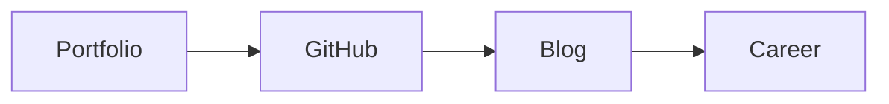

# 🚀 المحفظة

> بناء محفظة احترافية، GitHub Profile، تدوين تقني — أظهر مهاراتك للعالم.

## 🎯 أهداف التعلم

بعد إكمال هذه الوحدة، ستكون قادراً على:

- [**بناء المحفظة**](01-portfolio-building) — مشاريع وأدلة
- [**GitHub Profile**](02-github-profile-mastery) — حساب احترافي
- [**تدوين تقني**](03-technical-blogging-speaking) — كتابة وتحدث

## 💡 المهارات التي ستكتسبها

Portfolio • GitHub Profile • Blogging • Speaking

## 📊 معلومات الوحدة

| العنصر           | القيمة                |
| ---------------- | --------------------- |
| **المستوى**      | مبتدئ                 |
| **الوقت المقدر** | 3 ساعات               |
| **المتطلبات**    | أي من الوحدات السابقة |
| **الشهادات**     | —                     |

## 🏛️ مهمة CloudNova

> ابنِ محفظة Cloud Engineer تلفت انتباه مسؤولي التوظيف في 6 ثوانٍ.

## 🗺️ خريطة الوحدة

## 📖 الدروس

- [**بناء المحفظة**](01-portfolio-building) — مشاريع وأدلة
- [**GitHub Profile**](02-github-profile-mastery) — حساب احترافي
- [**تدوين تقني**](03-technical-blogging-speaking) — كتابة وتحدث

## 🚀 ابدأ التعلم

[▶️ ابدأ الدرس الأول](01-portfolio-building)
