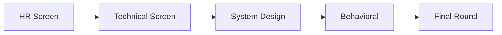

# التحضير للمقابلة (Interview Preparation)

> "التحضير للمقابلة ليس حفظ إجابات. إنه فهم كيف تفكر وتحل المشكلات."

## 🎯 أهداف التعلم

- إتقان الأسئلة التقنية (Azure, K8s, Terraform, Networking)
- التحضير لـ System Design Interview
- الإجابة عن الأسئلة السلوكية بـ STAR
- التفاوض على الراتب والمزايا
- بناء خطة تحضير 4 أسابيع

---

## 📖 الطبقة الأساسية: هيكل المقابلة



---

## 🧱 الطبقة المهنية: أسئلة تقنية حاسمة

### Q: كيف تشخص CrashLoopBackOff؟

```bash
# ١. فحص الحالة
kubectl describe pod <name> | grep -A10 "State:"

# ٢. آخر سجلات قبل الموت
kubectl logs <pod> --previous

# ٣. أسباب شائعة:
# OOMKilled → ضاعف memory limit
# ImagePullBackOff → تأكد من اسم الصورة و registry
# ConfigMap/Secret مفقود → تأكد من الـ references
```

### Q: كيف تنفذ Disaster Recovery في Azure؟

```
RPO = كم بيانات قد نخسر
RTO = كم وقت للاستعادة

Backup: RPO 24h, RTO 4h, Cost $
Warm Standby: RPO 5min, RTO 15min, Cost $$$
Active-Active: RPO 0, RTO 0, Cost $$$$

اختر حسب: الميزانية + متطلبات العمل
```

---

## 🏗️ الطبقة الإنتاجية: System Design

### إطار الإجابة

```
١. Clarify: كم مستخدم؟ ميزانية؟ قيود أمنية؟
٢. High-Level: ارسم الـ architecture
٣. Deep Dive: أي جزء هو bottleneck؟
٤. Trade-offs: Cost vs Performance vs Simplicity
```

### مثال: منصة SaaS لـ 100K مستخدم

```
Frontend: Azure Front Door + CDN + WAF
Backend: AKS (microservices) + Azure Functions
Data: Azure SQL + Cosmos DB + Redis Cache
Security: Entra ID B2C + Key Vault + Private Endpoints
Monitoring: Application Insights + Grafana
التكلفة: $12-18K/شهر
SLA: 99.95%
```

---

## 🎨 الطبقة المعمارية: STAR Method

### STAR = Situation → Task → Action → Result

```
س: "حدثني عن وقت تعاملت مع Incident صعب"

S: "في CloudNova، تعطلت خدمة الدفع في Black Friday"
T: "كنت المسؤول عن استعادة الخدمة بأسرع وقت"
A: "شخصت المشكلة في connection pool،
    زدت max connections مؤقتاً،
    أصلحت الكود لمنع التكرار"
R: "استعدنا الخدمة في 12 دقيقة،
    تجنبنا خسارة $50,000"

⚠️ كل قصة تحتاج أرقاماً! (وقت، مال، مستخدمون)
```

---

## ⚡ الإنتاج وما بعده: التفاوض

```
قبل:
├── ابحث عن رواتب السوق: Glassdoor, Levels.fyi
├── اعرف الـ range للشركة
└── حدد: الرقم المثالي + الحد الأدنى

أثناء:
├── لا تذكر راتبك الحالي!
├── "ما هو الـ range لهذا المنصب؟"
└── فاوض على الحزمة كاملة:
    راتب + أسهم + بونص + Remote + تدريب

أخطاء:
├── قبول العرض الأول فوراً (يترك 10-20%)
├── التفاوض على الراتب فقط وتجاهل الأسهم
└── ذكر رقم منخفض أولاً

جملة سحرية:
"بناءً على أبحاثي لسوق ومهاراتي في K8s و Terraform،
 أتوقع نطاق X-Y. هل هذا ممكن؟"
```

---

## 🗓️ خطة تحضير 4 أسابيع

```
الأسبوع 1: التقني — Azure + K8s + Terraform
الأسبوع 2: الأدوات — Docker + CI/CD + Git
الأسبوع 3: System Design — 5 تصاميم مختلفة
الأسبوع 4: Behavioral — 10 قصص STAR + Mock interviews
```

---

## 🧠 التذكّر النشط

1. ما هي مراحل المقابلة الخمس؟
2. كيف تجيب عن System Design في 4 خطوات؟
3. ما هي طريقة STAR؟ أعط مثالاً
4. كيف تتفاوض على الراتب دون ذكر راتبك الحالي؟
5. ما أهم 3 أسئلة تسألها أنت في المقابلة؟

## 🎤 أسئلة للمحاور

```
١. "كيف يبدو يوم مهندس سحابة في فريقكم؟"
٢. "ما أكبر تحدٍّ تقني تواجهونه حالياً؟"
٣. "كيف تقيسون نجاح المهندس هنا؟"
```

---

[← العودة إلى الموديول](../index.md) | [🏠 الرئيسية](/)
