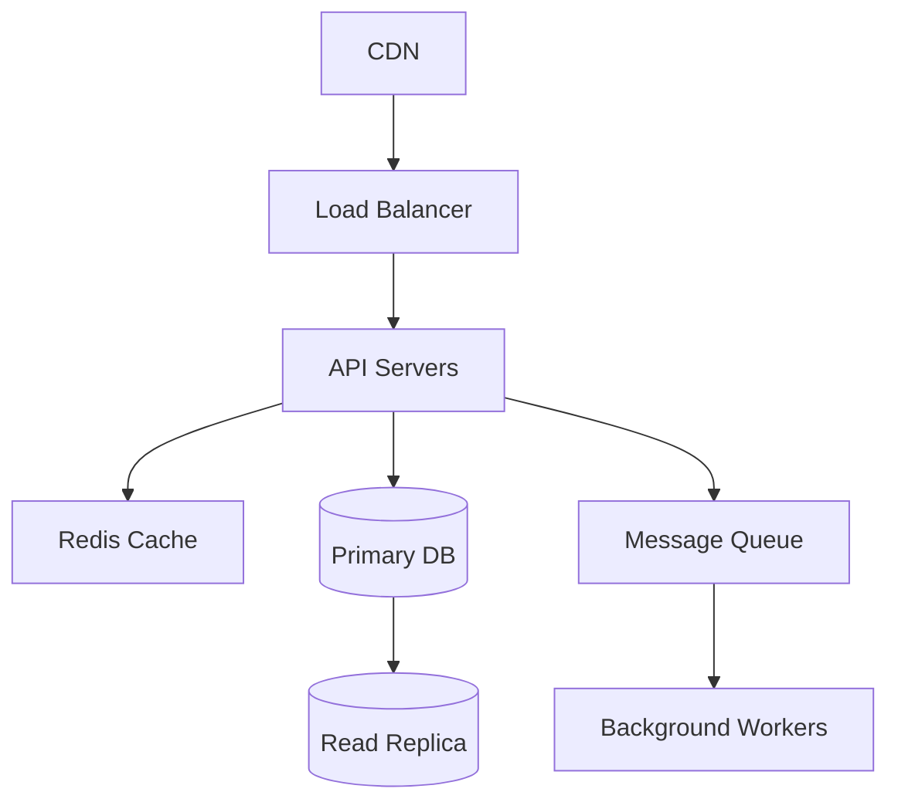

# System Design Masterclass

> "System Design ليس عن الحفظ. إنه عن التفكير الهندسي."

## 🎯 أهداف التعلم

- إطار System Design المنهجي
- تصميم URL Shortener
- تصميم Chat System
- تصميم Cloud Infrastructure

## ⏱️ الوقت المقدر: 50 دقيقة | المستوى: Advanced

---

## 🏗️ إطار System Design

### 1. المتطلبات (5 دقائق)
- Functional: ماذا يفعل النظام؟
- Non-functional: كم مستخدم؟ كم طلب/ثانية؟ latency؟

### 2. التقديرات (5 دقائق)
```
100M مستخدم نشط يومياً
1000 writes/sec → 100,000 reads/sec
10 years × 100M users × 1KB = 1PB data
```

### 3. التصميم عالي المستوى (10 دقائق)


### 4. التعمق (15 دقيقة)
- Database schema
- API design
- Scaling strategy
- Failure modes

### مثال: تصميم URL Shortener

```python
# توليد short URL
import hashlib, base64

def shorten(url):
    hash = hashlib.md5(url.encode()).digest()[:6]
    return base64.urlsafe_b64encode(hash).decode()[:8]

# تخزين
# Key: short_code → Value: original_url
# Redis: 100K reads/sec, 1M keys
```

---

## 🎤 أسئلة تدريب

1. صمم Twitter Timeline
2. صمم Google Drive
3. صمم Cloud Infrastructure Monitoring System

---

[← Technical Interview](./02-technical-interview-deep-qa) | [→ Salary Negotiation](./04-salary-negotiation-career-growth) | [🏠 الرئيسية](/)
