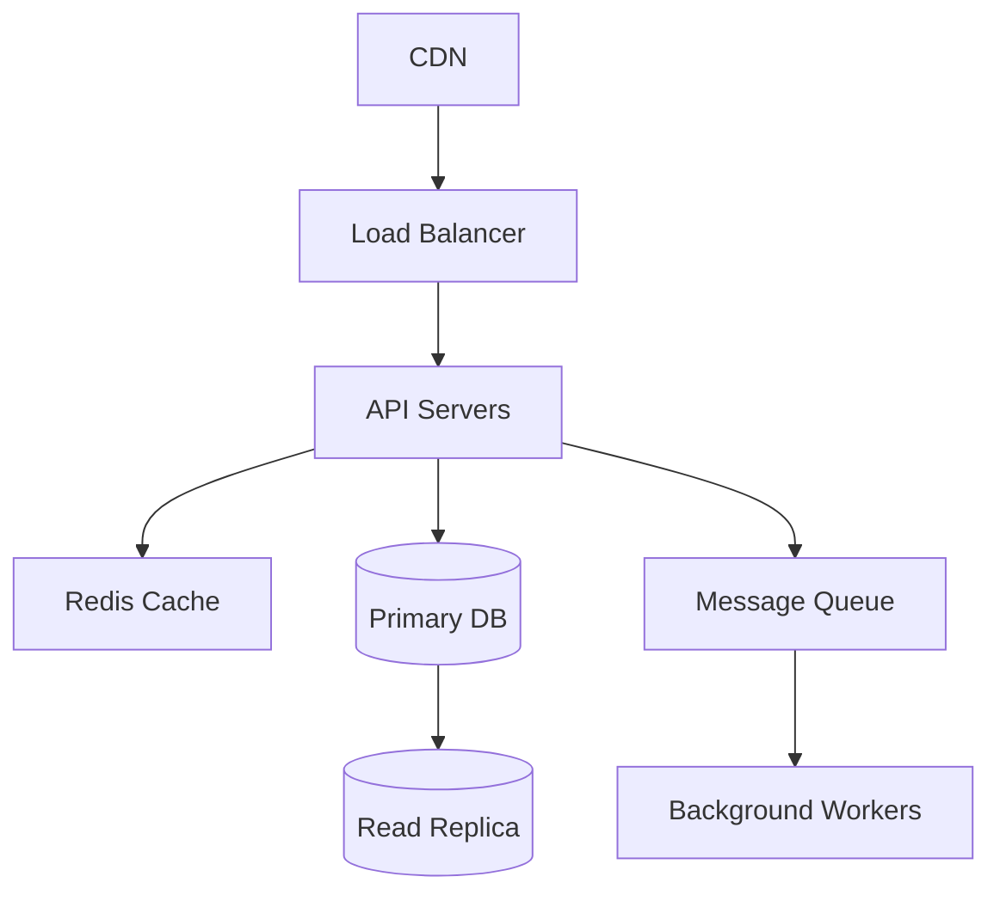
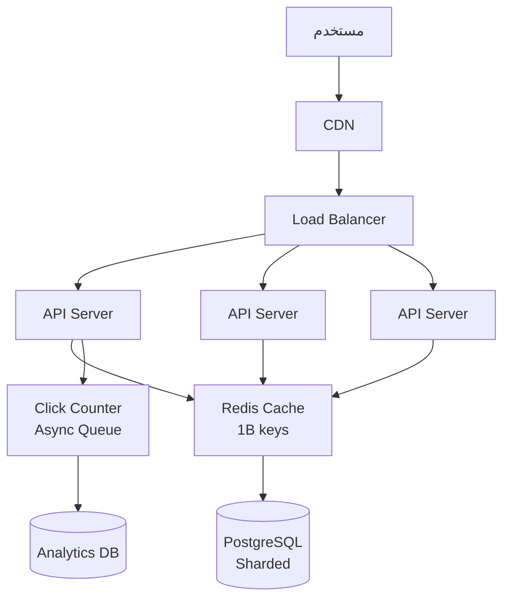

# System Design Masterclass

> "System Design ليس عن الحفظ. إنه عن التفكير الهندسي."

## 🎯 أهداف التعلم

- إطار System Design المنهجي
- تصميم URL Shortener
- تصميم Chat System
- تصميم Cloud Infrastructure

## ⏱️ الوقت المقدر: 50 دقيقة | المستوى: Advanced

---

## 🏗️ إطار System Design

### 1. المتطلبات (5 دقائق)
- Functional: ماذا يفعل النظام؟
- Non-functional: كم مستخدم؟ كم طلب/ثانية؟ latency؟

### 2. التقديرات (5 دقائق)
```
100M مستخدم نشط يومياً
1000 writes/sec → 100,000 reads/sec
10 years × 100M users × 1KB = 1PB data
```

### 3. التصميم عالي المستوى (10 دقائق)


### 4. التعمق (15 دقيقة)
- Database schema
- API design
- Scaling strategy
- Failure modes

### مثال: تصميم URL Shortener

```python
# توليد short URL
import hashlib, base64

def shorten(url):
    hash = hashlib.md5(url.encode()).digest()[:6]
    return base64.urlsafe_b64encode(hash).decode()[:8]

# تخزين
# Key: short_code → Value: original_url
# Redis: 100K reads/sec, 1M keys
```

---

## 🎤 أسئلة تدريب

1. صمم Twitter Timeline
2. صمم Google Drive
3. صمم Cloud Infrastructure Monitoring System

---

## 🏛️ CloudNova: تصميم منصة في 45 دقيقة

** عبدالعزيز** أجرى مقابلة System Design في CloudNova. السؤال: "صمم URL Shortener مثل bit.ly."

### إجابته خطوة بخطوة:

**1. توضيح المتطلبات (5 دقائق):**
- Functional: shorten URL, redirect, analytics, custom aliases, expiration
- Non-functional: 100M URLs, 1000 writes/sec, 100K reads/sec, latency < 10ms, 99.99% availability

**2. تقديرات سريعة (3 دقائق):**
```
100M URLs × 5 years = 500M URLs
متوسط 500 bytes لكل URL = 250GB storage
100K reads/sec → 100K × 86400 = 8.6B reads/day
```

**3. تصميم عالي المستوى (10 دقائق):**


**4. التعمق — تخزين الـ URLs (15 دقيقة):**
- **Short Code Generation:** Base62 encoding من MD5 hash
- **Database Sharding:** shard على أول حرفين من short code (36×36 = 1296 shard)
- **Caching:** Redis, 90% reads من cache, TTL أسبوع
- **Rate Limiting:** Token bucket, 100 writes/sec per user

**5. مناقشة trade-offs (10 دقائق):**
- NoSQL vs SQL: SQL أفضل (ACID, no duplicate short codes)
- Pre-generated vs on-demand: on-demand أبسط وأكثر كفاءة
- Custom aliases: collision handling + abuse prevention

**النتيجة:** قبل في CloudNova! السبب: عملية منظمة، أسئلة ذكية، trade-off analysis.

---

## 🎨 إطار System Design المنهجي

### 6 خطوات لا تتغير

| الخطوة | الوقت | المخرجات |
|--------|-------|---------|
| **1. المتطلبات** | 5 min | Functional + Non-functional + Constraints |
| **2. التقديرات** | 3 min | Storage, Bandwidth, QPS, Latency |
| **3. High-Level Design** | 10 min | Architecture diagram + Data flow |
| **4. Deep Dive** | 15 min | Database schema, API, Scaling, Failure |
| **5. Trade-offs** | 10 min | Why this over that? Cost vs Performance |
| **6. Wrap-up** | 2 min | Summary + Future improvements |

### أخطاء شائعة في System Design Interviews

- ❌ القفز مباشرة إلى الرسم بدون متطلبات
- ❌ إهمال non-functional requirements
- ❌ تصميم مثالي غير عملي
- ❌ عدم مناقشة trade-offs
- ❌ الصمت — تحدث بصوت عالٍ!

---

## 🛠️ تدريبات عملية

### تمرين 1: صمم Twitter Timeline
```
المتطلبات:
- 500M مستخدم، 200M tweets/يوم
- Timeline: آخر 500 tweet بترتيب زمني
- Fan-out on write (push to followers' timelines)
-名人效应: مستخدمون بـ 100M followers

صمم:
1. Functional + Non-functional requirements
2. Architecture diagram (Mermaid)
3. Database schema
4. How to handle名人 users
```

### تمرين 2: صمم Google Drive
```
المتطلبات:
- Upload/download/edit files
- Version history (30 يوماً)
- Sharing with permissions
- 1B users, 10GB/user

صمم:
1. File storage strategy (chunking, dedup)
2. Metadata storage
3. Conflict resolution (Last Write Wins vs CRDT)
4. Sharing model
```

### تحدي: صمم منصة المراقبة لـ 1000 AKS cluster
```
المتطلبات:
- جمع metrics من 1000 cluster
- 10M metrics/second
- Dashboard + Alerting
- تخزين 2 سنة

صمم:
1. Metrics ingestion pipeline
2. Storage: Time-series DB (Prometheus/Cortex/Thanos)
3. Query layer
4. High availability architecture
5. Cost optimization
```

---

## 📝 تقييم

### ✅ Knowledge Checks
1. ما الخطوة الأولى في System Design interview؟
2. كيف تقدر storage requirements؟
3. متى تختار SQL على NoSQL؟
4. ما الفرق بين vertical و horizontal scaling؟
5. كيف تصمم rate limiter؟

### 🧠 Quiz
**س1:** الخطوة الأولى في System Design:
- أ) الرسم
- ب) المتطلبات ✅
- ج) الكود
- د) الـ database

**س2:** Sharding يعني:
- أ) نسخ البيانات
- ب) تقسيم البيانات عبر خوادم متعددة ✅
- ج) حذف البيانات
- د) تشفير البيانات

**س3:** CAP Theorem:
- أ) Consistency + Availability + Partition tolerance — اختر 2 ✅
- ب) كلها معاً
- ج) لا شيء
- د) لا أعرف

### 🗣️ Active Recall
1. ارسم معماري URL Shortener من الذاكرة
2. صف 6 خطوات System Design بصوت عالٍ
3. قارن بين SQL و NoSQL في 3 use cases
4. اشرح CAP Theorem بأمثلة

### 🎓 Feynman Exercise
> اشرح Load Balancer لغير تقني: "مثل موظف استقبال في بنك. يقف عند المدخل ويوزع الزبائن على الموظفين المتاحين. لا أحد ينتظر طويلاً، ولا موظف مرهق."

### 🃏 بطاقات تعلم
| السؤال | الإجابة |
|--------|---------|
| ما الخطوة الأولى؟ | Clarify requirements |
| ما Sharding؟ | تقسيم البيانات أفقياً |
| SQL vs NoSQL؟ | SQL للعلاقات، NoSQL للمرونة |
| CAP Theorem؟ | Consistency, Availability, Partition — 2/3 |
| ما CDN؟ | شبكة توزيع محتوى للـ static assets |

---

## 🎤 أسئلة System Design شائعة

1. صمم Chat System (WhatsApp)
2. صمم Video Streaming (YouTube)
3. صمم Search Autocomplete
4. صمم Distributed Lock Manager
5. صمم Notification System

### نموذج إجابة: صمم Rate Limiter
```
1. المتطلبات: 10K requests/sec, accuracy 99.9%, distributed
2. الخوارزمية: Token Bucket (مرونة أفضل من Fixed Window)
3. التصميم: Redis Cluster (atomic operations) + Lua scripts
4. المفاتيح: user_id:minute → counter
5. الـ headers: X-RateLimit-Remaining, X-RateLimit-Reset
6. Trade-off: accuracy vs latency (local vs centralized counter)
```

---

## 📚 المراجع
| النوع | الرابط |
|--------|--------|
| **درس ذو صلة** | [Technical Interview](./02-technical-interview-deep-qa) |
| **كتاب** | [Designing Data-Intensive Applications](https://dataintensive.net/) |
| **موقع** | [System Design Primer](https://github.com/donnemartin/system-design-primer) |
| **مرجع** | [Azure Architecture Center](https://learn.microsoft.com/azure/architecture/) |

---

[← Technical Interview](./02-technical-interview-deep-qa) | [→ Salary Negotiation](./04-salary-negotiation-career-growth) | [🏠 الرئيسية](/)
