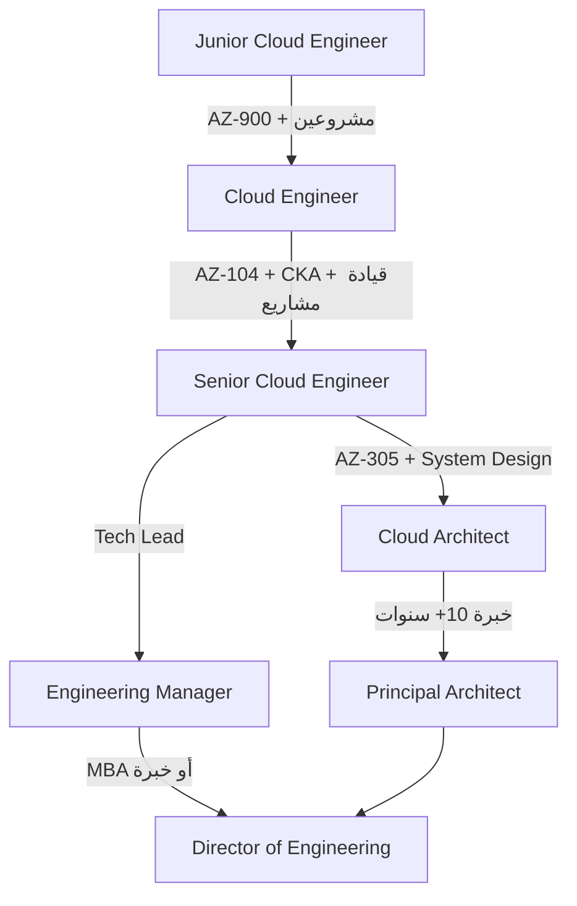

# المسار الوظيفي في السحابة

> "مهندس السحابة ليس مجرد وظيفة. إنه رحلة مستمرة من التعلم والتطور."

## 🎯 أهداف التعلم

- فهم خريطة المسار الوظيفي من Junior إلى Architect
- معرفة الشهادات والرواتب في كل مرحلة
- بناء خطة تطوير مهني لمدة 12 شهراً
- إتقان مهارات التفاوض والتسويق الشخصي
- تجنب الأخطاء القاتلة في المسار الوظيفي

---

## 📖 الطبقة الأساسية: سلم Cloud Engineer الوظيفي

### المراحل الوظيفية الخمس

```
المرحلة 1: Junior Cloud Engineer (0-2 سنوات)
├── الراتب: $65K - $90K
├── الدور: تنفيذ المهام، مراقبة، نشر بسيط
├── الشهادات: AZ-900، AI-900
├── المهارات: Linux، أساسيات Azure، Git، Bash
└── نصيحة: ابنِ أساساً قوياً — لا تتسرع للترقية

المرحلة 2: Cloud Engineer (2-4 سنوات)
├── الراتب: $90K - $130K
├── الدور: تصميم الحلول، أتمتة، CI/CD
├── الشهادات: AZ-104، CKA
├── المهارات: Terraform، Docker، Kubernetes، Python
└── نصيحة: ركّز على الأتمتة — كل ما تكرره، اكتب له كوداً

المرحلة 3: Senior Cloud Engineer (4-7 سنوات)
├── الراتب: $130K - $170K
├── الدور: Architecture، Mentoring، Incidents، System Design
├── الشهادات: AZ-400 (DevOps)، AZ-305 (Architect)
├── المهارات: Observability، FinOps، Security، Leadership
└── نصيحة: لا تبقَ في منطقة الراحة. تحمّل Incidents وقيادة المشاريع

المرحلة 4: Cloud Architect (7-10 سنوات)
├── الراتب: $170K - $220K
├── الدور: تصميم المؤسسة، حوكمة، استراتيجية multi-cloud
├── الشهادات: الخبرة أهم من أي شهادة جديدة
├── المهارات: Enterprise patterns، Multi-cloud، Leadership، Business
└── نصيحة: Architect ليس مجرد Senior قوي. إنه دور مختلف — تركيز على "لماذا" وليس "كيف"

المرحلة 5: Principal/Director (10+ سنوات)
├── الراتب: $200K - $350K+
├── الدور: رؤية تقنية، فرق متعددة، قرارات استراتيجية
├── المهارات: Business acumen، People management، Strategy
└── نصيحة: في هذا المستوى، 70% من وقتك = قيادة وإستراتيجية، 30% = تقني
```

### Technical Track vs Management Track

```
Technical Track (IC — Individual Contributor):
Junior → Cloud Engineer → Senior → Staff Engineer → Principal Engineer → Distinguished Engineer
الميزة: ابقَ قريباً من الكود والتقنية
التحدي: سقف الراتب قد يكون أقل من management

Management Track:
Cloud Engineer → Senior → Tech Lead → Engineering Manager → Director → VP
الميزة: رواتب أعلى، تأثير أوسع
التحدي: Meetings أكثر، Coding أقل، إدارة أشخاص
```

---

## 🧱 الطبقة المهنية: خطة التطوير — 12 شهراً

### Junior إلى Cloud Engineer

```
الشهر 1-3: الأساسيات
├── Linux المتقدم: systemd، networking، cron، troubleshooting
├── Azure Fundamentals (AZ-900)
├── Git + GitHub: branching، PRs، CODEOWNERS
└── المشروع: Static website منشور عبر CI/CD

الشهر 4-6: الأدوات
├── Docker: Multi-stage builds، docker-compose، security
├── Kubernetes: Deployments، Services، Ingress، Helm
├── Terraform: IaC، modules، state management
└── المشروع: Dockerized API على Azure App Service

الشهر 7-9: التخصص
├── Azure Administrator (AZ-104)
├── CI/CD: GitHub Actions، OIDC، environments
├── Monitoring: Prometheus، Grafana، AlertManager
└── المشروع: Kubernetes cluster على AKS مع monitoring

الشهر 10-12: الاحتراف + البحث عن وظيفة
├── System Design interviews
├── بناء Portfolio متكامل (CloudNova Platform)
├── التقديم على وظائف Cloud Engineer
└── LinkedIn optimization
```

---

## 🏗️ الطبقة الإنتاجية: المهارات الأكثر طلباً (2026)

```
حسب تحليل سوق العمل:

1. Kubernetes (90% من الوظائف)        ████████████████████
2. Terraform (85%)                     ███████████████████
3. Azure/AWS (80%)                     ██████████████████
4. CI/CD (75%)                         █████████████████
5. Python (70%)                        ███████████████
6. Docker (65%)                        ██████████████
7. Monitoring/Observability (60%)      █████████████
8. Security/DevSecOps (55%)            ███████████
9. FinOps (40%)                        █████████
10. AI/ML Infrastructure (35%)         ███████
```

> **ملاحظة:** Kubernetes + Terraform + Azure = الثالوث الذهبي لـ 2026.

---

## 🎨 الطبقة المعمارية: LinkedIn & Personal Brand

### بناء Profile محترف

```
LinkedIn Profile Checklist:

□ صورة احترافية (ليست سيلفي! خلفية محايدة، ملابس مهنية)
□ Headline: "Cloud Engineer | Azure | Kubernetes | Terraform"
  └── استخدم الكلمات المفتاحية التي يبحث عنها الـ recruiters
□ About: قصة قصيرة عن شغفك بالسحابة (3-5 أسطر)
  └── "بدأت رحلتي في السحابة عندما..."
□ Featured: أهم 3 مشاريع + شهادات + منشورات
□ Experience: ليس فقط المسمى الوظيفي — الإنجازات!
  ├── "قللت التكاليف السحابية 40% عبر FinOps automation"
  ├── "أتمتة نشر 20 خدمة — من 4 ساعات إلى 10 دقائق"
  └── "قُدتُ هجرة 50 تطبيقاً من VMs إلى Kubernetes"
□ Skills (مرتبة): Kubernetes، Terraform، Azure، Docker، Python
  └── اطلب endorsements من زملاء (ليس الغرض العدد — الجودة)
□ Recommendations: اطلبها من مديرين وزملاء
```

### نصائح ذهبية للـ LinkedIn

```
❌ لا تفعل:
├── "مسؤول عن Kubernetes" — وماذا بعد؟ هذا مسمى، ليس إنجازاً
├── Profile فارغ من الإنجازات والأرقام
├── طلب اتصال بدون رسالة شخصية
├── Skills كثيرة وغير مركزة (20 skill!)
├── نشر محتوى منسوخ أو مترجم آلياً

✅ افعل:
├── "بنيت منصة GitOps وفرت 80% وقت النشر لـ 15 فريقاً"
├── اكتب Articles عن تجاربك التقنية الحقيقية
├── شارك مشاريع GitHub وأرفق Architecture Diagrams
├── احضر Meetups وتواصل مع المهندسين (علاقات حقيقية)
├── علّق على منشورات الآخرين بمحتوى ذكي ومفيد
```

---

## ⚡ الإنتاج وما بعده: التفاوض على الراتب

```
قبل المقابلة:
├── ابحث عن متوسط الرواتب في منطقتك (Glassdoor, Levels.fyi)
├── اعرف الـ range للشركة المستهدفة
└── حدد الرقم الذي تريده + الرقم الذي ستقبل به

أثناء التفاوض:
├── لا تذكر راتبك الحالي أبداً
├── عندما يُسأل "كم تتوقع؟": "ما هو الـ range للمنصب؟"
├── فاوض على الحزمة كاملة: راتب + أسهم + بونص + remote
└── لا تقبل العرض الأول فوراً. اطلب 24 ساعة للتفكير

جمل سحرية:
├── "بناءً على أبحاثي للسوق ومهاراتي في Kubernetes و Terraform،
│    أتوقع راتباً في نطاق X-Y."
├── "هل هناك مرونة في الـ range؟"
└── "أنا متحمس جداً للفرصة. هل يمكننا مناقشة الحزمة كاملة؟"

أخطاء شائعة:
├── قبول العرض الأول دون تفاوض (يترك 10-20% على الطاولة)
├── ذكر رقم منخفض في البداية (لا يمكنك الصعود كثيراً بعده)
└── التفاوض بقوة على الراتب وتجاهل الأسهم (قد تكون قيمتها أكبر)
```

---

## 🏥 سيناريو CloudNova: Career Mode

### رحلتك في CloudNova

```
أنت: Junior Cloud Engineer في CloudNova

📅 الشهر 1-2: Onboarding
├── المهمة: إعداد بيئة التطوير + أول نشر بسيط
├── التعلم: Azure Portal، Azure CLI، Git workflow
├── المرشد: Sarah (Senior — 6 سنوات خبرة)
└── المهارة: أساسيات Azure، Git، CI/CD

📅 الشهر 3-4: أول مشروع حقيقي
├── المهمة: أتمتة نشر تطبيق على App Service
├── التحدي: الـ deployment كان يدوياً ويأخذ 3 ساعات
├── الحل: GitHub Actions pipeline — الآن 10 دقائق
└── المهارة: CI/CD، GitHub Actions، YAML

📅 الشهر 5-6: أول حادثة إنتاجية
├── الموقف: CPU 100% في الإنتاج. الخدمة متوقفة.
├── الإجراء: تشخيص، تحديد العملية، kill، restart
├── التعلم: لا panic. ابدأ من الأساسيات (CPU، Memory، Disk، Network)
├── النتيجة: حل المشكلة في 15 دقيقة. أول إشادة من المدير
└── المهارة: Troubleshooting، Monitoring، الهدوء تحت الضغط

📅 الشهر 12: ترقية
├── الترقية: Cloud Engineer
├── الإنجازات: 3 مشاريع، 2 Incidents، 1 Automation
├── الزيادة: 25% راتب أساسي
└── الشهادة: AZ-104 ✅

📅 السنة 2-3: قيادة مشروع
├── الترقية: Senior Cloud Engineer
├── المشروع: هجرة 20 خدمة من VMs إلى Kubernetes
├── الفريق: 3 مهندسين تعمل معهم
├── النتيجة: تخفيض التكاليف 40%، تحسين الـ uptime لـ 99.95%
└── المهارة: System Design، Mentoring، Project Management
```

---

## 🏛️ الشهادات — خريطة كاملة

```
المستوى المبتدئ (Junior — 0-2 سنوات):
├── AZ-900 (Azure Fundamentals) — شهرين تحضير
├── AI-900 (AI Fundamentals) — اختياري
└── التكلفة: $99 لكل امتحان

المستوى المتوسط (Cloud Engineer — 2-4 سنوات):
├── AZ-104 (Azure Administrator) — 3-4 أشهر تحضير
├── CKA (Certified Kubernetes Administrator) — 3 أشهر
├── التكلفة: $165 + $395
└── ⚡ هاتان الشهادتان هما بوابة السوق

المستوى المتقدم (Senior — 4-7 سنوات):
├── AZ-400 (DevOps Engineer) — 4-6 أشهر تحضير
├── AZ-305 (Solutions Architect) — 4-6 أشهر تحضير
├── CKS (Kubernetes Security) — 3 أشهر
└── التكلفة: $165 + $165 + $395

المستوى الخبير (Architect+ — 7+ سنوات):
├── AI-102 (AI Engineer) — 4-6 أشهر
├── TOGAF (Enterprise Architecture) — 6 أشهر
└── التكلفة: $165 + $500+

نصيحة: لا تجمع الشهادات بدون خبرة. شهادة + مشروع > 3 شهادات بدون مشروع.
```

---

## 🚨 أخطاء وظيفية قاتلة

```
❌ البقاء في شركة واحدة أكثر من 5 سنوات بدون ترقية
   → السوق يتحرك أسرع من شركتك. غيّر كل 2-3 سنوات إن لم تنمُ

❌ التركيز على الشهادات وإهمال المشاريع الحقيقية
   → الشهادة = أنك "تعرف". المشروع = أنك "تستطيع" (وهو الأهم)

❌ التخصص الضيق جداً مبكراً
   → لا تتخصص في Kubernetes فقط قبل أن تفهم Linux، Networking، Security
   → T-shape: عمق في K8s، عرض في Linux + Network + CI/CD + Cloud

❌ إهمال الـ soft skills
   → Senior = 40% تقني + 60% تواصل، Mentoring، Leadership
   → إذا كنت الأذكى لكن لا أحد يفهمك — لن تترقى

❌ التقديم على وظائف غير مناسبة
   → Junior على وظيفة Senior = تضييع وقتك ووقتهم
   → اقرأ الوصف جيداً. هل تملك 70% من المهارات المطلوبة؟
```

---

## 📊 رسم بياني: مسار النمو الوظيفي



---

## 🧠 التذكّر النشط

1. ما الفرق بين Cloud Engineer و Cloud Architect من حيث المسؤوليات اليومية؟
2. ما أهم 3 مهارات لـ Cloud Engineer في سوق 2026؟
3. كيف تبني LinkedIn Profile يجذب الـ recruiters (وليس فقط الأصدقاء)؟
4. ما الشهادة التالية في مسارك؟ ولماذا هي بالذات؟
5. كيف تجيب عن "احكِ لي عن نفسك" في المقابلة بطريقة STAR؟

## ✍️ تمرين Feynman

اشرح لشخص جديد في المجال: "كيف تختار بين Technical Track و Management Track؟ وما إيجابيات وسلبيات كل منهما؟"

## 📝 بطاقات تعليمية

- **AZ-104**: شهادة Azure Administrator — بوابتك لسوق العمل. تغطي 80% مما تحتاجه يومياً
- **CKA**: شهادة Kubernetes العملية. امتحان عملي 100% (وليس أسئلة اختيارية)
- **STAR Method**: طريقة الإجابة في المقابلات: Situation → Task → Action → Result
- **T-Shape Skills**: عمق في مجال واحد، عرض في عدة مجالات. أفضل استراتيجية للنمو
- **FinOps**: مهارة إدارة التكاليف السحابية. تميزك عن 90% من المرشحين

## 🎤 أسئلة المقابلة — مع إجابات نموذجية

1. **"أين ترى نفسك بعد 3 سنوات؟"**

   > "أرى نفسي Senior Cloud Engineer أقود مشاريع هجرة معقدة وأوجه Junior Engineers.
   > أخطط للحصول على AZ-305 وقيادة تصميم منصة multi-cloud.
   > أريد بناء خبرة في System Design و Enterprise Architecture."

2. **"ما أكبر خطأ تقني ارتكبته؟"**

   > "حذفت production database بالخطأ أثناء صيانة ليلية.
   > لحسن الحظ كان معنا backups وreplication — استعدنا الخدمة في 20 دقيقة.
   > تعلمت: (١) double-check كل أمر قبل تنفيذه، (٢) أنشأت safeguards تلقائية،
   > (٣) وثّقت الـ runbook حتى لا يكرر أحد الخطأ."

3. **"لماذا تريد العمل معنا؟"**
   > "أتابع Engineering Blog لشركتكم منذ سنة. أعجبني مقالكم عن هجرة Kubernetes.
   > أرى أن خبرتي في Terraform و GitOps تناسب تحولكم الحالي.
   > وأريد التعلم من فريقكم القوي في Observability."

---

## نصائح الإنتاج — الخلاصة

1. **ابنِ Portfolio قبل السيرة الذاتية.** GitHub يتحدث عنك
2. **تعلّم بشكل T-shape.** عمق في مجالين، عرض في 5-6 مجالات
3. **غيّر وظيفتك كل 2-3 سنوات إن لم تنمُ.** السوق يكافئ من يتحرك
4. **الشهادة + المشروع > 3 شهادات بدون مشروع**
5. **Soft skills لا تقل أهمية عن التقنية.** خاصة من Senior فما فوق
6. **لا تتوقف عن التعلم.** السحابة تتغير كل 6 أشهر
7. **ابنِ علاقات حقيقية.** LinkedIn ليس منصة جمع أرقام
8. **فاوض دائماً.** أول عرض = أرضية، وليس سقفاً

---

[← العودة للموديول](./01-cloud-career-paths) | [🏠 الرئيسية](/)
