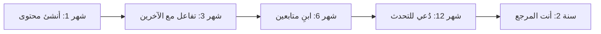

# بناء الشبكة المهنية والعلامة الشخصية

> "شبكتك المهنية هي أعلى أصل في مسيرتك. ابنِها قبل أن تحتاجها."

## 🎯 أهداف التعلم

- بناء شبكة مهنية في السحابة
- Personal Branding
- حضور المؤتمرات والفعاليات
- التواصل الفعال على LinkedIn و Twitter/X

## ⏱️ الوقت المقدر: 25 دقيقة | المستوى: Junior

---

## 🏗️ استراتيجية التواصل

### 1. LinkedIn

```markdown
- انشر مرة أسبوعياً: حل مشكلة تقنية واجهتها
- علّق على منشورات Azure و Kubernetes
- تابع: Azure Advocates, Kubernetes Maintainers, Cloud Architects
- انضم إلى: Azure Community, CNCF Groups
```

### 2. Twitter/X

```markdown
- تابع: @Azure, @KubernetesIO, @HashiCorp
- شارك: تغريدات عن challenges تقنية
- استخدم: #Azure #Kubernetes #DevOps #CloudEngineering
```

### 3. المجتمع

- **User Groups**: Azure Meetup, CNCF meetup
- **المؤتمرات**: Microsoft Ignite, KubeCon, HashiConf
- **المساهمة**: Open Source, Stack Overflow, GitHub Discussions

### Personal Brand Statement

```
"أنا [اسمك]، Cloud Engineer أساعد الشركات في بناء
بنية تحتية سحابية موثوقة وآمنة باستخدام Azure و Kubernetes و Terraform."
```

---

## 🏛️ CloudNova: تغريدة غيرت مساراً

**بسام** Cloud Engineer. نشر تغريدة عن مشكلة Azure networking واجهها:

> "قضيت 4 ساعات في debugging Azure VNet peering. المشكلة: route table كان له priority أعلى من المتوقع. تعلمت: دائماً افحص Effective Routes أولاً. 🧵"

النتيجة:
- 850 retweet, 3,200 likes
- 4 مديري توظيف في الـ DMs
- Azure Networking team ردت رسمياً
- دُعي للكتابة في Azure blog!

**الدرس:** لا تحتاج 100,000 متابع. تحتاج المحتوى الصحيح أمام الشخص الصحيح.

### استراتيجية المحتوى على LinkedIn

```markdown
الأسبوع 1: مشاركة مشكلة تقنية وحلها
الأسبوع 2: مراجعة كتاب/دورة
الأسبوع 3: سؤال للنقاش (engagement)
الأسبوع 4: إنجاز شخصي/شهادة
```

**أمثلة منشورات LinkedIn ناجحة:**
1. "3 أخطاء في Terraform كلفت شركتي $5,000. لا تكررها:"
2. "اجتزت AZ-104! هذه الموارد التي ساعدتني (مجانية):"
3. "سؤال لـ DevOps engineers: Bicep ولا Terraform لـ Azure؟ ولماذا؟"
4. "كيف بنيت homelab cloud بـ $50/شهر للتدرب:"

---

## 🎨 بناء العلامة الشخصية

### 3 ركائز للعلامة الشخصية

| الركيزة | ماذا؟ | مثال |
|--------|-------|------|
| **الخبرة** | ماذا تعرف؟ | Azure, Kubernetes, Terraform |
| **المحتوى** | ماذا تشارك؟ | مقالات، تغريدات، فيديوهات |
| **المجتمع** | من يعرفك؟ | متابعين، زملاء، mentors |

### مراحل بناء المجتمع



### Networking — كيف تبني علاقات حقيقية

```markdown
❌ "مرحباً، أنا [اسم]. هل من فرصة عمل؟"

✅ "مرحباً [اسم]،
قرأت مقالك عن [موضوع] وأعجبني تحليلك لـ [نقطة محددة].
أنا أعمل على [مشروع مشابه] وأتساءل:
كيف تعاملت مع [تحدي معين]؟
شكراً لوقتك!"
```

**قاعدة 80/20 للشبكات:**
- 80%: أعطِ قيمة (شارك، ساعد، علم)
- 20%: اطلب (نصيحة، introduction، فرصة)

---

## 🛠️ تدريبات عملية

### تمرين 1: اكتب بيان علامتك الشخصية
```
أنا [اسم]، [Role] أساعد [جمهور مستهدف]
في [ماذا تفعل] باستخدام [تقنيات].

مثال:
"أنا بسام، Cloud Engineer أساعد الشركات الناشئة
في بناء بنية تحتية سحابية موثوقة على Azure
باستخدام Kubernetes و Terraform و DevOps."
```

### تمرين 2: خطة محتوى شهرية
```markdown
الأسبوع 1: [موضوع تقني] + صورة/رسم بياني
الأسبوع 2: [درس تعلمته] + سؤال للجمهور
الأسبوع 3: [مشاركة مقال/فيديو مفيد]
الأسبوع 4: [إنجاز شخصي] + شكر للمجتمع

انشر على: LinkedIn + Twitter/X
```

### تحدي: 30 يوماً من البناء
```markdown
اليوم 1-7: حدد تخصصك (niche)
اليوم 8-14: اكتب 3 منشورات
اليوم 15-21: تواصل مع 10 أشخاص جدد
اليوم 22-28: شارك في 5 نقاشات
اليوم 29-30: قيّم تقدمك

الهدف: 100 متابع جديد، 5 محادثات مهنية
```

---

## 📝 تقييم

### ✅ Knowledge Checks
1. ما أفضل وقت للنشر على LinkedIn؟
2. كيف تبني متابعين بدون محتوى رديء؟
3. ما قاعدة 80/20 في networking؟
4. كيف تتواصل مع شخص لا تعرفه؟
5. ما الفرق بين personal brand و company brand؟

### 🧠 Quiz
**س1:** أفضل رسالة لشخص لا تعرفه:
- أ) "هل من وظيفة؟"
- ب) تعليق محدد على محتواه + سؤال ذكي ✅
- ج) "أضفني"
- د) إرسال سيرة ذاتية فوراً

**س2:** كم مرة تنشر على LinkedIn:
- أ) كل ساعة
- ب) مرة أسبوعياً minimum ✅
- ج) أبداً
- د) مرة سنوياً

**س3:** Personal Brand هو:
- أ) شعار
- ب) ما يعتقده الناس عنك مهنياً ✅
- ج) سيرتك الذاتية
- د) صورتك

### 🗣️ Active Recall
1. صف استراتيجية محتوى لمدة 3 أشهر
2. كيف تبني شبكة مهنية من الصفر؟
3. ارسم خريطة لمنصات التواصل — أيهم أهم؟
4. ما الفرق بين networking و begging؟

### 🎓 Feynman Exercise
> اشرح Personal Branding لصديق: "مثل نكهة مطعم. عندما يسمع الناس اسمك، ماذا يتبادر لأذهانهم؟ 'خبير Azure'؟ 'حلال مشاكل'؟ 'متحدث ممتاز'؟ هذا ما تبنيه بكل منشور ومقال."

### 🃏 بطاقات تعلم
| السؤال | الإجابة |
|--------|---------|
| ما Personal Brand؟ | سمعتك المهنية — ماذا يعتقد الناس عنك |
| كم مرة أنشر؟ | مرة أسبوعياً minimum |
| أفضل منصة للمهندسين؟ | LinkedIn + Twitter/X |
| قاعدة 80/20 في networking؟ | 80% أعطِ، 20% اطلب |
| كيف تبدأ من الصفر؟ | شارك ما تتعلمه يومياً |

---

## 🎤 أسئلة المقابلة

**س1:** "كيف تواكب تطور التقنيات؟"
> "أتابع Azure Updates يومياً. أقرأ مدونات Kubernetes. أجرب كل تقنية جديدة في homelab. أنشر ما أتعلمه أسبوعياً. أحضر مؤتمراً واحداً على الأقل سنوياً."

**س2:** "من قدوتك التقنية؟"
> "أتابع [اسم خبير] في [مجال]. لكن الأهم: أتعلم من كل شخص أعمل معه. كل زميل لديه منظور فريد."

**س3:** "كيف تتعامل مع الصراع في الفريق؟"
> "أركز على المشكلة، لا الشخص. أطرح البيانات، لا الآراء. أبحث عن حل وسط يخدم هدف المشروع. وإذا لزم: escalation محترم."

---

## 📚 المراجع
| النوع | الرابط |
|--------|--------|
| **درس ذو صلة** | [Resume Optimization](./02-resume-linkedin-optimization) |
| **أداة** | [LinkedIn](https://www.linkedin.com/) |
| **مرجع** | [Developer Marketing Guide](https://dev.to/) |
| **كتاب** | Show Your Work! — Austin Kleon |

---

[← Resume Optimization](./02-resume-linkedin-optimization) | [→ Freelancing](./04-freelancing-consulting) | [🏠 الرئيسية](/)
