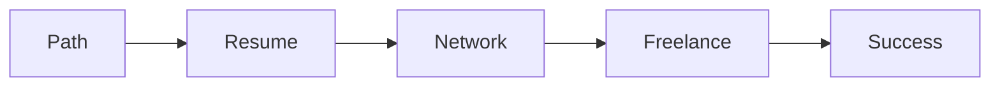

# 🚀 المسار المهني

> مسارات السحابة، السيرة الذاتية، LinkedIn، العمل الحر — ابنِ مستقبلك.

## 🎯 أهداف التعلم

بعد إكمال هذه الوحدة، ستكون قادراً على:

- [**مسارات السحابة**](01-cloud-career-paths) — اختر طريقك
- [**سيرة ذاتية**](02-resume-linkedin-optimization) — ATS Optimization
- [**شبكة العلاقات**](03-networking-personal-brand) — Personal Brand
- [**العمل الحر**](04-freelancing-consulting) — استشارات

## 💡 المهارات التي ستكتسبها

Career Paths • Resume • LinkedIn • Networking • Freelancing

## 📊 معلومات الوحدة

| العنصر           | القيمة    |
| ---------------- | --------- |
| **المستوى**      | مبتدئ     |
| **الوقت المقدر** | 5 ساعات   |
| **المتطلبات**    | المقابلات |
| **الشهادات**     | —         |

## 🏛️ مهمة CloudNova

> أنت الآن Cloud Architect في CloudNova. ابنِ خطة 5 سنوات لمستقبلك المهني.

## 🗺️ خريطة الوحدة

## 📖 الدروس

- [**مسارات السحابة**](01-cloud-career-paths) — اختر طريقك
- [**سيرة ذاتية**](02-resume-linkedin-optimization) — ATS Optimization
- [**شبكة العلاقات**](03-networking-personal-brand) — Personal Brand
- [**العمل الحر**](04-freelancing-consulting) — استشارات

## 🚀 ابدأ التعلم

[▶️ ابدأ الدرس الأول](01-cloud-career-paths)
