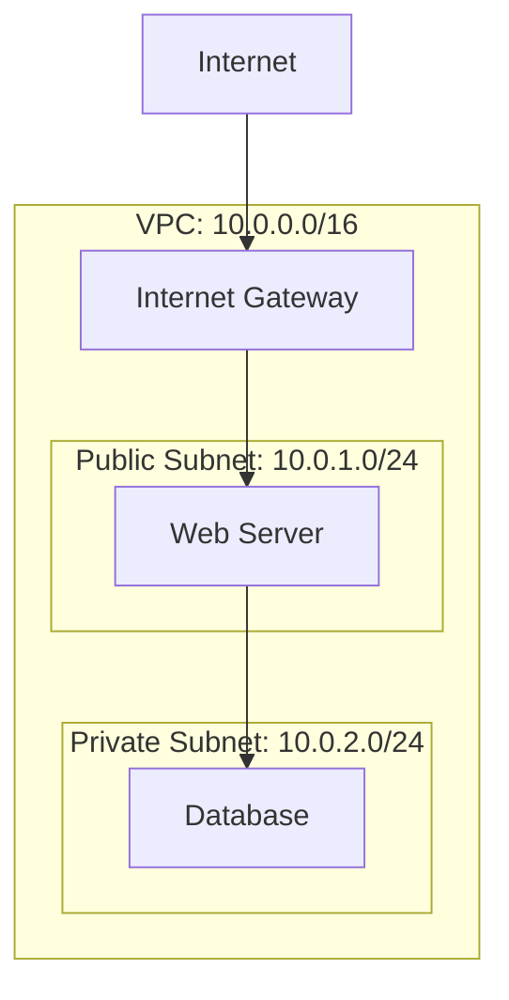

import Tabs from "@theme/Tabs";
import TabItem from "@theme/TabItem";

# Introduction to Virtual Private Clouds

## Learning Objectives

After completing this lesson, you will be able to:

- Define what a Virtual Private Cloud (VPC) is and explain its role in cloud architecture
- Create a VPC with public and private subnets
- Configure route tables and internet gateways
- Understand CIDR notation and IP address planning

## Prerequisites

Before starting this lesson, you should understand:

- Basic networking concepts (IP addresses, subnets)
- Fundamental cloud computing concepts

## Introduction

A **Virtual Private Cloud (VPC)** is your own isolated section of the cloud where you can launch resources in a virtual network that you define. Think of it as your private data center, but in the cloud.

## Core Content

### What is a VPC?

A VPC gives you complete control over your virtual networking environment, including:

- **IP address range** selection
- **Subnet** creation
- **Route table** configuration
- **Network gateways**
- **Security** settings

<Tabs>
  <TabItem value="aws" label="AWS VPC" default>
    AWS VPC is the foundational networking service in AWS. Every AWS account comes with a default
    VPC in each region.
  </TabItem>
  <TabItem value="azure" label="Azure VNet">
    Azure Virtual Network (VNet) is the equivalent service. VNets provide similar isolation and
    control.
  </TabItem>
  <TabItem value="gcp" label="GCP VPC">
    GCP VPC networks are global — subnets span regions. This is a key architectural difference from
    AWS and Azure.
  </TabItem>
</Tabs>

### CIDR Notation

CIDR (Classless Inter-Domain Routing) notation defines your IP address range:

| CIDR Block    | Available IPs | Use Case          |
| ------------- | ------------- | ----------------- |
| `10.0.0.0/28` | 16            | Very small subnet |
| `10.0.0.0/24` | 256           | Single subnet     |
| `10.0.0.0/16` | 65,536        | Full VPC          |

### Subnets

Subnets divide your VPC into smaller network segments:

- **Public subnets** — Resources that need internet access
- **Private subnets** — Resources that should not be directly accessible from the internet

## Key Takeaways

- A VPC is your isolated virtual network in the cloud
- CIDR notation defines your IP address space
- Subnets segment your VPC into public and private zones
- Route tables control traffic flow
- Security groups and NACLs provide defense in depth

## Check Your Understanding

1. What is the difference between a public and private subnet?
2. How many IP addresses are available in a `/24` CIDR block?
3. Why would you use multiple Availability Zones within a VPC?

## Next Steps

- [Lesson: Security Groups and NACLs](/lessons/networking/security-groups)
- [Project: Build a Multi-Tier VPC](/projects/multi-tier-vpc)
