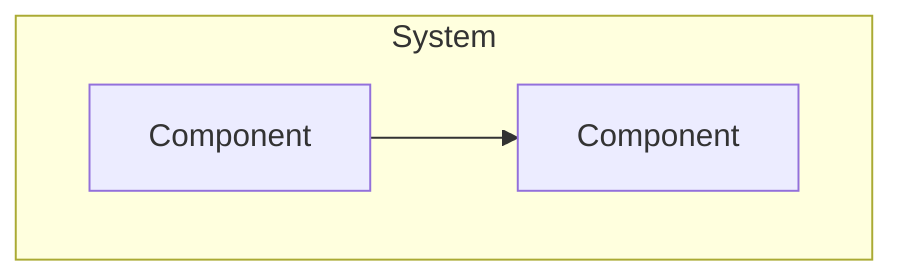

# Architecture Review: [Title]

## Context
What was the situation? What were the constraints?

## Requirements
- Functional requirement 1
- Non-functional requirement 1
- Constraint 1

## Decision
We decided to...

## Alternatives Considered

| Alternative | Pros | Cons |
|---|---|---|
| Option A | ... | ... |
| Option B | ... | ... |

## Architecture Diagram

## Trade-offs
- Trade-off 1: We chose X over Y because...
- Trade-off 2

## Consequences
- Positive: ...
- Negative: ...
- Neutral: ...

## Lessons Learned
- Lesson 1

## When to Use This Pattern
- When X
- When Y

## When NOT to Use This Pattern
- When Z
