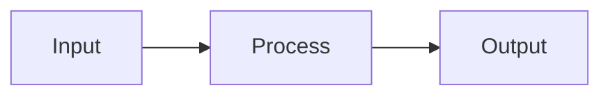

# Concept Title

## Overview

<!-- Brief, high-level explanation of the concept. -->

## Why It Matters

<!-- Why should a cloud engineer care about this concept? -->

## Core Explanation

<!-- Main explanation with diagrams and examples. -->

## Real-World Applications

- Application 1: Description
- Application 2: Description

## Common Misconceptions

| Misconception | Reality |
|---|---|
| "Myth" | "Fact" |

## Key Terms

| Term | Definition |
|---|---|
| Term 1 | Definition |
| Term 2 | Definition |

## Related Concepts

- [Related Concept 1](/curriculum/related-1)
- [Related Concept 2](/curriculum/related-2)

## Next Steps

- [Lesson: Applying This Concept](/lessons/applying-concept)
- [Project: Hands-On Practice](/projects/hands-on-project)
