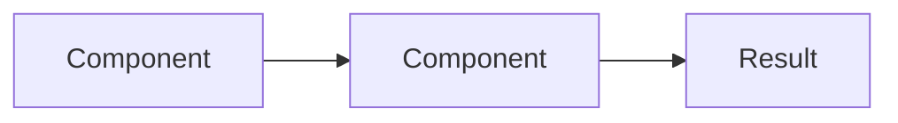

# Lesson Title

## Learning Objectives

After completing this lesson, you will be able to:

- Objective 1 (measurable, action-oriented)
- Objective 2
- Objective 3

## Prerequisites

Before starting this lesson, you should understand:

- [Prerequisite Concept](/lessons/prereq-slug)
- Basic command-line usage
- Fundamental cloud concepts

## Introduction

<!-- 1-2 paragraphs setting context. Why does this topic matter? -->

## Core Content

<!-- Main body. Use H2 for major sections, H3 for sub-sections. -->

### Sub-topic 1

Content with code examples, diagrams, and explanations.

```bash
# Example command or code
```

### Sub-topic 2



## Hands-On Exercise

<!-- Practical exercise for the learner. -->

1. Step 1
2. Step 2
3. Step 3

**Expected Result:** What the learner should see.

## Key Takeaways

- Key point 1
- Key point 2
- Key point 3

## Check Your Understanding

1. Question 1?
2. Question 2?
3. Question 3?

## Next Steps

- [Next Lesson](/lessons/next-topic)
- [Related Project](/projects/related-project)
- [Deeper Dive](/reference/deeper-topic)
