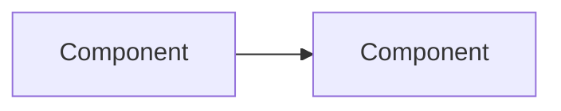

import Info from "@site/src/components/Info";
import Warning from "@site/src/components/Warning";
import Tip from "@site/src/components/Tip";
import BestPractice from "@site/src/components/BestPractice";
import ProductionNote from "@site/src/components/ProductionNote";
import ArchitectureNote from "@site/src/components/ArchitectureNote";
import SecurityNote from "@site/src/components/SecurityNote";
import CostNote from "@site/src/components/CostNote";
import InterviewQuestion from "@site/src/components/InterviewQuestion";
import Challenge from "@site/src/components/Challenge";
import Exercise from "@site/src/components/Exercise";
import Quiz from "@site/src/components/Quiz";
import Definition from "@site/src/components/Definition";
import Example from "@site/src/components/Example";
import Analogy from "@site/src/components/Analogy";
import CheatSheet from "@site/src/components/CheatSheet";
import CommonMistake from "@site/src/components/CommonMistake";
import Debugging from "@site/src/components/Debugging";
import DecisionPoint from "@site/src/components/DecisionPoint";
import AIExplanation from "@site/src/components/AIExplanation";
import AIQuiz from "@site/src/components/AIQuiz";
import AIFlashcards from "@site/src/components/AIFlashcards";
import Simulator from "@site/src/components/Simulator";

# Lesson Title

:::level simple
[Simple explanation — plain language, everyday analogies, no jargon]
:::

:::level core
[Core explanation — standard technical explanation]
:::

:::level professional
[Professional explanation — deep configuration, CLI examples, API references]
:::

:::level production
[Production explanation — war stories, incident reports, monitoring patterns]
:::

:::level architect
[Architect explanation — system-level thinking, trade-offs, organizational impact]
:::

## Learning Objectives

After completing this lesson, you will be able to:

- Objective 1
- Objective 2

## Prerequisites

- [Prerequisite 1](/lessons/prereq-1)
- Skill: Skill Name (basic proficiency)

## Core Content

### Section 1

Content with diagrams:

<Info>Additional context here.</Info>

### Section 2

<Tip>Pro tip: a time-saving technique.</Tip>

<Example title="Real-World Example">Concrete example here.</Example>

<Definition term="Term">Definition here.</Definition>

## Common Mistakes

<CommonMistake mistake="Common error" correction="Correct approach" />

## Production Notes

<ProductionNote>Production experience: ...</ProductionNote>

## Architecture Notes

<ArchitectureNote>At scale, consider: ...</ArchitectureNote>

## Security

<SecurityNote>Security consideration: ...</SecurityNote>

## Cost

<CostNote>Cost implication: approximately $X/month for Y workload.</CostNote>

## Hands-On Exercise

<Exercise title="Exercise Title" instructions="Step-by-step instructions" />

## Challenge

<Challenge title="Challenge Title" description="Challenge description" timeEstimate="15 min" />

## Debugging Practice

<Debugging
  scenario="Scenario"
  symptoms={["Symptom 1"]}
  diagnosis="Diagnosis steps"
  solution="Solution"
/>

## Architecture Decision

<DecisionPoint
  options={["Option A", "Option B"]}
  criteria={["Cost", "Performance"]}
  recommendation="Option B"
/>

## Interview Preparation

<InterviewQuestion
  question="Interview question?"
  expectedTopics={["Topic 1"]}
  difficulty="medium"
  careerLevel="cloud_engineer"
/>

## AI-Powered Review

<AIExplanation topic="Topic" level="auto" />
<AIQuiz topic="Topic" count={5} difficulty="intermediate" />
<AIFlashcards topic="Topic" count={10} />

## Key Takeaways

- Key point 1
- Key point 2

## Cheat Sheet

<CheatSheet title="Quick Reference" items={["Command 1", "Command 2", "Pattern 1"]} />

## Check Your Understanding

<Quiz questions={[{ question: "Q1?", options: ["A", "B", "C"], correct: 0 }]} />

## Active Recall

- Question: "Key question?"
- Question: "Another question?"

## Feynman Check

Can you explain this concept to someone non-technical in 2 sentences?

## Next Steps

- [Next Lesson](/lessons/next-topic)
- [Related Lab](/labs/related-lab)
- [Related Project](/projects/related-project)

## Spaced Repetition

This topic will appear in your review on: Day 1, Day 3, Day 7, Day 14, Day 30, Day 90
