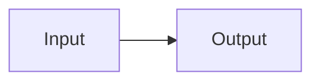

# [Concept Name]

**5-second version:** [One sentence explanation]

## What It Is
Brief explanation.

## Why It Matters
Single paragraph.

## How It Works



## Quick Example
```bash
# Example
```

## Key Takeaway
One sentence summary.

## Next
- [Full Lesson](/lessons/full-lesson)
