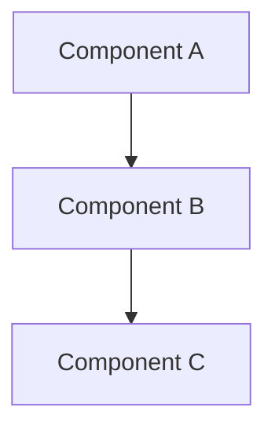

# Project Title

## Overview

<!-- 2-3 sentences describing the project and its real-world relevance. -->

## Learning Objectives

- Objective 1
- Objective 2
- Objective 3

## Prerequisites

- [Lesson 1](/lessons/lesson-1)
- [Lesson 2](/lessons/lesson-2)

## Architecture

<!-- High-level diagram of what you'll build. -->



## Project Setup

### Prerequisites

- Tool 1 (version X.Y+)
- Tool 2

### Initial Setup

```bash
# Setup commands
```

## Implementation Steps

### Step 1: Title

<!-- Detailed instructions -->

### Step 2: Title

<!-- Detailed instructions -->

## Validation

How to verify the project works correctly:

1. Check 1
2. Check 2

## Cleanup

```bash
# Cleanup commands to avoid charges
```

## Key Takeaways

- Takeaway 1
- Takeaway 2

## Extensions

Ideas for extending the project:

1. Extension idea 1
2. Extension idea 2
