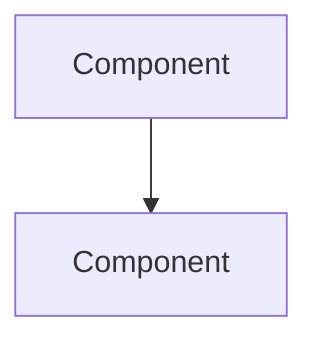

import Info from "@site/src/components/Info";
import Challenge from "@site/src/components/Challenge";
import BestPractice from "@site/src/components/BestPractice";

# Project Title

## Overview
Project description and real-world relevance.

## Architecture



## Learning Objectives
- Objective 1

## Prerequisites
- [Lesson](/lessons/prereq)

## Setup

```bash
# Setup commands
```

## Implementation

### Step 1: Title
Instructions.

<BestPractice>Best practice guidance.</BestPractice>

### Step 2: Title
Instructions.

## Validation
How to verify the project works.

## Deliverables Checklist
- [ ] Deliverable 1
- [ ] Deliverable 2

## Extensions
<Challenge title="Extension" description="For advanced learners" />

## Portfolio
This project demonstrates skills in: [skills]

## Cleanup
```bash
# Cleanup commands
```

## Grading Rubric
| Criterion | Weight |
|---|---|
| Criterion | 0.4 |
