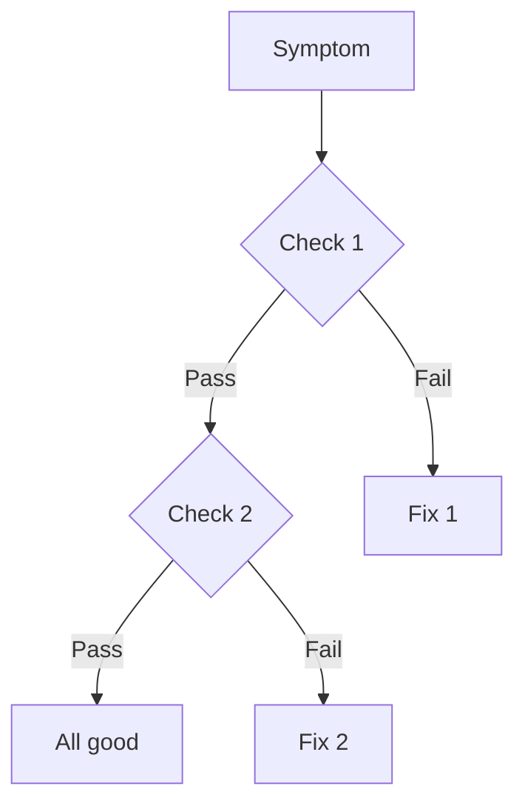

import Debugging from "@site/src/components/Debugging";

# Troubleshooting: [Topic]

## Common Symptoms

- Symptom 1
- Symptom 2

## Quick Diagnosis Flow



## Step-by-Step Diagnosis

### Step 1: Check X

```bash
# Command to run
```

**If you see X:** Go to step 2
**If you see Y:** Go to step 3

### Step 2: Check Y

## Common Resolutions

| Problem | Solution |
| ------- | -------- |
| Issue 1 | Fix 1    |
| Issue 2 | Fix 2    |

## Prevention

- How to prevent this issue
- Monitoring to detect it early
